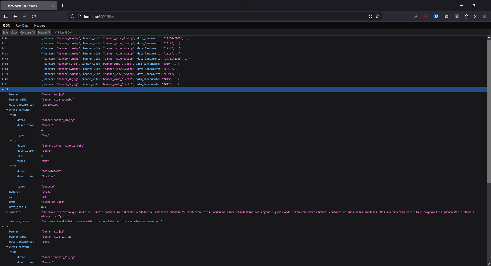
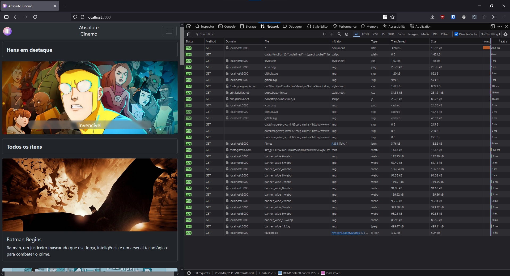

# Trabalho Prático - Semana 11

## Informações do trabalho

- Nome: Mateus Junior
- Matricula: 1598679
- Proposta de projeto escolhida: Catálogo de Filmes
- Breve descrição sobre seu projeto: O Absolute Cinema é um catálogo de filmes completo para cinéfilos, oferecendo informações detalhadas, críticas e recomendações sobre uma vasta seleção de filmes.

**Print do teste da API com visualização do JSON**

**Print da aba NETWORK com requisições Fetch/XHR**

---

- Ícones (logo) criados em [icon.kitchen](https://icon.kitchen).
- Ícones (social) baixados de [simpleicons.org](https://simpleicons.org).
- Outros icones baixados em [fonts.google/icons](https://fonts.google.com/icons) e [fontawesome](https://fontawesome.com).
- Fonte Utilizada: [Comfortaa](https://fonts.google.com/specimen/Comfortaa).
- Imagens de banners retiradas do site [The Movie Database](https://www.themoviedb.org).

Outras Ferramentas utilizadas:

- <https://pseitz.github.io/toml-to-json-online-converter>
- <https://jsonformatter.curiousconcept.com>
